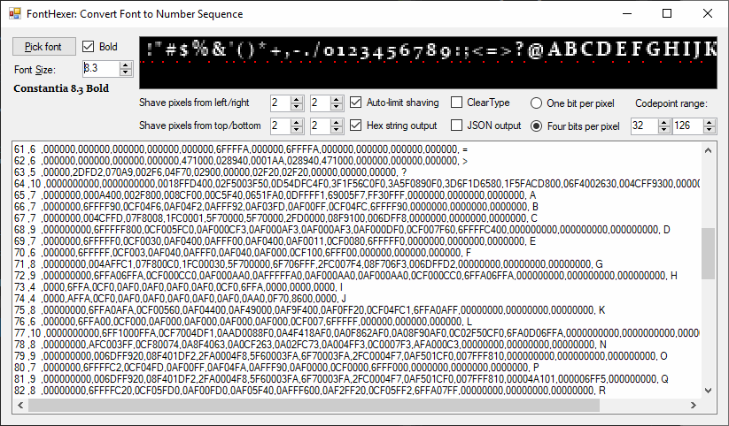

# FontHexer

This C# program converts fonts that are installed on your computer into bitmap fonts (number sequence in CSV or JSON format).

Features include 

- 1 bit per pixel or 4 bits (hex digit per pixel). 1-bit mode disables antialiasing by default.
- Shaving off empty and almost-empty columns on the left or right side of each character
- Shaving off empty scanlines if they are empty for every character in the range
- ClearType AntiAliasing on or off
- JSON or CSV output
- Change font size in increments of 0.1 pt
- Retro 90s-style interface

### Example 1-bit proportional font: Tahoma 8.7pt

CSV Columns: ASCII code, width, scanlines..., character (not escaped)

~~~csv
MaxWidth: 18.19108, MaxHeight: 15.45156
32 ,1  ,0,0,0,0,0,0,0,0,0,0,0,0,  
33 ,3  ,0,6,6,6,6,6,6,0,6,6,0,0, !
34 ,6  ,36,36,36,00,00,00,00,00,00,00,00,00, "
35 ,10 ,000,048,048,1FC,1FC,090,3F8,3F8,120,120,000,000, #
36 ,7  ,08,08,3E,69,68,3C,1E,0B,4B,3E,08,08, $
37 ,14 ,0000,1C10,3620,3640,3640,1C9C,0136,0136,0236,041C,0000,0000, %
38 ,9  ,000,0F0,198,198,0F0,0E6,1B6,19C,19C,0F6,000,000, &
39 ,3  ,6,6,6,0,0,0,0,0,0,0,0,0, '
40 ,5  ,06,0C,0C,18,18,18,18,18,18,0C,0C,06, (
41 ,5  ,18,0C,0C,06,06,06,06,06,06,0C,0C,18, )
42 ,7  ,0C,2D,1E,2D,0C,00,00,00,00,00,00,00, *
43 ,10 ,000,000,020,020,020,1FC,020,020,020,000,000,000, +
44 ,4  ,0,0,0,0,0,0,0,0,6,6,6,4, ,
45 ,5  ,00,00,00,00,00,1E,00,00,00,00,00,00, -
46 ,4  ,0,0,0,0,0,0,0,0,6,6,0,0, .
47 ,7  ,04,04,08,08,08,10,10,20,20,20,40,40, /
48 ,7  ,00,3E,63,63,63,63,63,63,63,3E,00,00, 0
49 ,7  ,00,0C,3C,0C,0C,0C,0C,0C,0C,3F,00,00, 1
50 ,7  ,00,3E,43,03,03,06,0C,18,30,7F,00,00, 2
51 ,7  ,00,3E,43,03,03,1E,03,03,43,3E,00,00, 3
52 ,7  ,00,06,0E,16,26,46,7F,06,06,06,00,00, 4
53 ,7  ,00,3F,30,30,3E,03,03,03,43,3E,00,00, 5
54 ,7  ,00,1E,30,60,7E,63,63,63,63,3E,00,00, 6
55 ,7  ,00,7F,03,06,06,0C,0C,18,18,18,00,00, 7
56 ,7  ,00,3E,63,63,63,3E,63,63,63,3E,00,00, 8
57 ,7  ,00,3E,63,63,63,63,3F,03,06,3C,00,00, 9
58 ,4  ,0,0,0,6,6,0,0,0,6,6,0,0, :
59 ,4  ,0,0,0,6,6,0,0,0,6,6,6,4, ;
60 ,10 ,000,000,006,018,060,180,180,060,018,006,000,000, <
61 ,10 ,000,000,000,000,1FC,000,000,1FC,000,000,000,000, =
62 ,10 ,000,000,180,060,018,006,006,018,060,180,000,000, >
63 ,7  ,00,3C,46,06,0C,18,18,00,18,18,00,00, ?
64 ,11 ,000,1F0,208,4F4,5B4,5B4,5B4,5B4,4D8,200,1F0,000, @
65 ,8  ,00,18,3C,3C,66,66,66,FF,C3,C3,00,00, A
66 ,8  ,00,FC,C6,C6,C6,FC,C6,C6,C6,FC,00,00, B
67 ,8  ,00,7C,C2,C2,C0,C0,C0,C2,C2,7C,00,00, C
68 ,9  ,000,1F8,18C,186,186,186,186,186,18C,1F8,000,000, D
69 ,7  ,00,7E,60,60,60,7E,60,60,60,7E,00,00, E
70 ,7  ,00,7C,60,60,60,7C,60,60,60,60,00,00, F
71 ,9  ,000,0F8,184,184,180,19C,18C,18C,18C,0FC,000,000, G
72 ,9  ,000,186,186,186,186,1FE,186,186,186,186,000,000, H
73 ,6  ,00,3C,18,18,18,18,18,18,18,3C,00,00, I
74 ,6  ,00,1E,06,06,06,06,06,06,06,3C,00,00, J
75 ,8  ,00,C6,CC,D8,F0,E0,F0,D8,CC,C6,00,00, K
76 ,7  ,00,60,60,60,60,60,60,60,60,7E,00,00, L
77 ,11 ,000,606,70E,79E,5F6,4E6,446,406,406,406,000,000, M
78 ,9  ,000,184,1C4,1C4,164,134,134,11C,11C,10C,000,000, N
79 ,9  ,000,0FC,186,186,186,186,186,186,186,0FC,000,000, O
80 ,8  ,00,FC,C6,C6,C6,C6,FC,C0,C0,C0,00,00, P
81 ,9  ,000,0FC,186,186,186,186,186,186,186,0FC,018,00E, Q
82 ,9  ,000,1F8,18C,18C,18C,1F8,1B0,198,18C,186,000,000, R
83 ,7  ,00,3E,61,61,60,3E,03,43,43,3E,00,00, S
84 ,7  ,00,7E,18,18,18,18,18,18,18,18,00,00, T
85 ,9  ,000,18C,18C,18C,18C,18C,18C,18C,18C,0F8,000,000, U
86 ,8  ,00,C6,C6,C6,6C,6C,6C,38,38,38,00,00, V
87 ,12 ,000,C46,CE6,CE6,CA6,7BC,7BC,7BC,318,318,000,000, W
88 ,8  ,00,C6,C6,6C,38,38,38,6C,C6,C6,00,00, X
89 ,8  ,00,CC,CC,CC,78,78,30,30,30,30,00,00, Y
90 ,7  ,00,7E,06,06,0C,18,30,60,60,7E,00,00, Z
91 ,5  ,1E,18,18,18,18,18,18,18,18,18,18,1E, [
92 ,7  ,40,40,20,20,20,10,10,08,08,08,04,04, \
93 ,5  ,1E,06,06,06,06,06,06,06,06,06,06,1E, ]
94 ,10 ,000,030,048,084,102,000,000,000,000,000,000,000, ^
95 ,8  ,00,00,00,00,00,00,00,00,00,00,00,FF, _
96 ,7  ,18,0C,00,00,00,00,00,00,00,00,00,00, `
97 ,8  ,00,00,00,38,4C,0C,7C,CC,CC,7C,00,00, a
98 ,8  ,C0,C0,C0,DC,E6,C6,C6,C6,C6,FC,00,00, b
99 ,7  ,00,00,00,3C,60,60,60,60,60,3C,00,00, c
100,8  ,06,06,06,7E,C6,C6,C6,C6,CE,76,00,00, d
101,8  ,00,00,00,78,CC,CC,FC,C0,C4,78,00,00, e
102,5  ,07,0C,0C,1E,0C,0C,0C,0C,0C,0C,00,00, f
103,8  ,00,00,00,7E,C6,C6,C6,C6,CE,76,06,7C, g
104,9  ,180,180,180,1B8,1CC,18C,18C,18C,18C,18C,000,000, h
105,4  ,0,C,0,C,C,C,C,C,C,C,0,0, i
106,5  ,00,0C,00,1C,0C,0C,0C,0C,0C,0C,0C,18, j
107,8  ,C0,C0,C0,CC,D8,F0,E0,F0,D8,CC,00,00, k
108,4  ,C,C,C,C,C,C,C,C,C,C,0,0, l
109,12 ,000,000,000,FB8,CCC,CCC,CCC,CCC,CCC,CCC,000,000, m
110,9  ,000,000,000,1B8,1CC,18C,18C,18C,18C,18C,000,000, n
111,8  ,00,00,00,7C,C6,C6,C6,C6,C6,7C,00,00, o
112,8  ,00,00,00,DC,E6,C6,C6,C6,C6,FC,C0,C0, p
113,8  ,00,00,00,7E,C6,C6,C6,C6,CE,76,06,06, q
114,6  ,00,00,00,34,3C,30,30,30,30,30,00,00, r
115,7  ,00,00,00,38,64,60,38,0C,4C,38,00,00, s
116,6  ,00,18,18,3E,18,18,18,18,18,0E,00,00, t
117,9  ,000,000,000,18C,18C,18C,18C,18C,19C,0EC,000,000, u
118,8  ,00,00,00,CC,CC,CC,78,78,30,30,00,00, v
119,11 ,000,000,000,666,666,36C,36C,3FC,198,198,000,000, w
120,8  ,00,00,00,CC,CC,78,30,78,CC,CC,00,00, x
121,8  ,00,00,00,CC,CC,CC,78,78,30,30,60,60, y
122,7  ,00,00,00,7C,0C,18,30,60,60,7C,00,00, z
123,8  ,1C,30,30,30,30,E0,30,30,30,30,30,1C, {
124,8  ,30,30,30,30,30,30,30,30,30,30,30,30, |
125,8  ,E0,30,30,30,30,1C,30,30,30,30,30,E0, }
126,11 ,000,000,000,000,384,7C4,47C,438,000,000,000,000, ~
~~~

### Example 4-bit small font: LessPixels 5pt

~~~csv
MaxWidth: 8.593649, MaxHeight: 8.471427
32 ,1  ,0,0,0,0,0,0,0,  
33 ,1  ,F,F,F,D,0,F,0, !
34 ,3  ,F0F,818,000,000,000,000,000, "
35 ,5  ,00000,0F0F0,FFFFF,0F0F0,FFFFF,0F0F0,00000, #
36 ,5  ,00600,0FFF6,F0F00,0FFF0,00F0F,6FFF0,00600, $
37 ,5  ,00000,AA02D,AA2D2,02D20,2D2AA,D20AA,00000, %
38 ,4  ,0000,CF00,F101,77F9,F0C0,AF40,0000, &
39 ,1  ,F,8,0,0,0,0,0, '
40 ,2  ,2D,F1,F0,F0,F1,2F,00, (
41 ,2  ,D2,1F,0F,0F,1F,F2,00, )
42 ,5  ,00D00,98F9A,08F80,0F1F0,00000,00000,00000, *
43 ,3  ,000,030,0F0,FFF,0F0,030,000, +
44 ,1  ,0,0,0,0,0,F,9, ,
45 ,2  ,00,00,00,FF,00,00,00, -
46 ,1  ,0,0,0,0,0,F,0, .
47 ,4  ,000D,0076,03C0,0C30,6700,D000,0000, /
48 ,3  ,0F0,F3F,F3F,F3F,F3F,1F1,000, 0
49 ,2  ,1F,FF,0F,0F,0F,0F,00, 1
50 ,3  ,4F4,90F,02C,0D1,C30,FFF,000, 2
51 ,3  ,8F7,30F,0FD,00F,30F,8F7,000, 3
52 ,3  ,0AF,84F,FFF,00F,00F,00F,000, 4
53 ,3  ,FFF,F00,FF4,30F,30F,FF4,000, 5
54 ,3  ,2F6,F00,FF2,F0F,F1F,2F2,000, 6
55 ,3  ,FFF,00F,02C,0F0,0F0,0F0,000, 7
56 ,3  ,0F0,F0F,1F1,F0F,F0F,0F0,000, 8
57 ,3  ,2F2,F2F,2FF,00F,00F,3F2,000, 9
58 ,1  ,0,0,F,0,0,F,0, :
59 ,1  ,0,0,F,0,0,F,9, ;
60 ,3  ,000,04F,4F2,F40,4F2,04F,000, <
61 ,3  ,000,000,FFF,000,FFF,000,000, =
62 ,3  ,000,F40,2F4,04F,2F4,F40,000, >
63 ,3  ,FD0,04C,2D0,3A0,000,290,000, ?
64 ,6  ,066640,400004,61FF06,6F1F06,61FCC4,400000,066630, @
65 ,3  ,0D0,F0F,F0F,FFF,F0F,F0F,000, A
66 ,3  ,FF0,F1F,FF0,F0F,F0F,FF0,000, B
67 ,3  ,2FC,F04,F00,F00,F04,0FC,000, C
68 ,3  ,FF2,F0F,F0F,F0F,F0F,FF2,000, D
69 ,3  ,FFF,F00,FF3,F00,F00,FFF,000, E
70 ,3  ,FFF,F00,FF6,F00,F00,F00,000, F
71 ,3  ,2FF,F20,F16,F0F,F2F,2FF,000, G
72 ,3  ,F0F,F0F,FFF,F0F,F0F,F0F,000, H
73 ,3  ,AFA,0F0,0F0,0F0,0F0,AFA,000, I
74 ,3  ,03F,00F,00F,00F,60F,FFA,000, J
75 ,3  ,F0F,F0F,FF1,F1F,F0F,F0F,000, K
76 ,3  ,F00,F00,F00,F00,F03,FFF,000, L
77 ,5  ,F000F,FD1FF,F0F1F,F0F0F,F000F,F000F,00000, M
78 ,4  ,F10F,F90F,FA3F,F3AF,F09F,F01F,0000, N
79 ,3  ,4F6,F0F,F0F,F0F,F0F,8F7,000, O
80 ,3  ,FF2,F1D,FF2,F00,F00,F00,000, P
81 ,4  ,0FF0,F00F,F00F,F00F,F0DF,0FFF,0003, Q
82 ,3  ,FF2,F1D,FF4,F2F,F0F,F0F,000, R
83 ,3  ,4FF,F02,860,068,20F,FF4,000, S
84 ,3  ,FFF,0F0,0F0,0F0,0F0,0F0,000, T
85 ,3  ,F0F,F0F,F0F,F0F,F0F,8F8,000, U
86 ,3  ,F0F,F0F,F0F,A3A,4D4,0A0,000, V
87 ,5  ,F000F,F030F,F0F0F,F0F0F,F4F4F,0F4D0,00000, W
88 ,3  ,F0F,C1D,0D0,F0F,F0F,F0F,000, X
89 ,3  ,F0F,C4C,2F1,0F0,0F0,0F0,000, Y
90 ,3  ,FFF,02A,0A3,3A0,A20,FFF,000, Z
91 ,2  ,FF,F0,F0,F0,F0,FF,00, [
92 ,4  ,D000,6700,0C30,03C0,0076,000D,0000, \
93 ,2  ,FF,0F,0F,0F,0F,FF,00, ]
94 ,3  ,1D1,848,000,000,000,000,000, ^
95 ,4  ,0000,0000,0000,0000,0000,0000,FFFF, _
96 ,2  ,C2,27,00,00,00,00,00, `
97 ,3  ,000,000,7C9,13F,C9F,DCF,000, a
98 ,3  ,F00,F00,FF0,F0F,F0F,FF0,000, b
99 ,2  ,00,00,7F,F0,F0,7F,00, c
100,3  ,00F,00F,0FF,F0F,F0F,0FF,000, d
101,3  ,000,000,4DC,FAD,F00,4FF,000, e
102,2  ,4F,F2,FA,F0,F0,F0,00, f
103,3  ,000,000,2F6,F1F,0FF,00F,FF2, g
104,3  ,F00,F00,FF7,F0F,F0F,F0F,000, h
105,1  ,D,1,F,F,F,F,0, i
106,2  ,0D,01,0F,0F,0F,0F,FC, j
107,3  ,F00,F00,F0F,FF1,F0F,F0F,000, k
108,1  ,F,F,F,F,F,F,0, l
109,5  ,00000,00000,FF2F0,F0F2F,F0F0F,F000F,00000, m
110,3  ,000,000,FF4,F0F,F0F,F0F,000, n
111,3  ,000,000,4F4,F0F,F0F,4F4,000, o
112,3  ,000,000,FF0,F0F,F0F,FF0,F00, p
113,3  ,000,000,0FF,F0F,F0F,0FF,00F, q
114,2  ,00,00,FF,F1,F0,F0,00, r
115,3  ,000,000,4FF,F30,03F,FF4,000, s
116,2  ,F0,F0,FF,F0,F2,4F,00, t
117,3  ,000,000,F0F,F0F,F0F,6FF,000, u
118,3  ,000,000,F0F,F0F,C3C,2D2,000, v
119,5  ,00000,00000,F000F,F0A0F,F4F4F,0F4F2,00000, w
120,3  ,000,000,F1F,1F1,D1D,F0F,000, x
121,3  ,000,000,F0F,F0F,8FF,02F,FF4, y
122,3  ,000,000,FFF,088,880,FFF,000, z
123,3  ,0FF,0A0,D10,0A0,0C0,0FF,000, {
124,1  ,F,F,F,F,F,F,F, |
125,3  ,FF0,0D0,00D,0A0,0D0,FF0,000, }
126,4  ,0000,2C09,A0C4,0000,0000,0000,0000, ~
~~~

### Example 4-bit bitmapped monospace font: DejaVu Sans Mono Bold

~~~csv
MaxWidth: 11.06002, MaxHeight: 14.95312
32 ,1  ,0,0,0,0,0,0,0,0,0,0,0,0,0,  
33 ,7  ,0000000,003FA00,003FA00,003FA00,003FA00,001F600,000F600,0000000,003FA00,003FA00,0000000,0000000,0000000, !
34 ,7  ,0000000,0AF0AF0,0AF0AF0,0AF0AF0,0000000,0000000,0000000,0000000,0000000,0000000,0000000,0000000,0000000, "
35 ,7  ,0000000,0000000,004F0C6,00791F2,3FFFFFF,02F1980,04F0D50,FFFFFF6,0F45D00,2F09700,0000000,0000000,0000000, #
36 ,7  ,0000000,000A000,06DFFF0,2F5A070,2F8C000,04FFF60,000A6F4,320A0F6,3F3A3F4,05DFF70,000A000,000A000,0000000, $
37 ,7  ,0000000,2DF4000,A54D000,A54D000,2DF4285,0049500,4730CF4,000670F,000670F,0001CF4,0000000,0000000,0000000, %
38 ,7  ,0000000,009FF20,05F7050,03F8000,02DF300,0F9FA0F,5F34F4F,6F40AFF,2FC05FA,04DFFDF,0000000,0000000,0000000, &
39 ,7  ,0000000,003F600,003F600,003F600,0000000,0000000,0000000,0000000,0000000,0000000,0000000,0000000,0000000, '
40 ,7  ,0001F30,000AC00,001F600,006F300,00AF000,00AF000,00AF000,006F300,001F600,000AC00,0001F30,0000000,0000000, (
41 ,7  ,00D6000,005F100,001F700,000DD00,000AF00,000AF00,000AF00,000DD00,001F700,005F100,00D6000,0000000,0000000, )
42 ,7  ,0000000,000F300,0A3F493,04DFF60,04DFF60,0A3F493,000F300,0000000,0000000,0000000,0000000,0000000,0000000, *
43 ,7  ,0000000,0000000,0000000,000F300,000F300,000F300,AFFFFFA,000F300,000F300,000F300,0000000,0000000,0000000, +
44 ,7  ,0000000,0000000,0000000,0000000,0000000,0000000,0000000,0000000,003F600,003F600,006F100,00A8000,0000000, ,
45 ,7  ,0000000,0000000,0000000,0000000,0000000,03FFF60,03FFF60,0000000,0000000,0000000,0000000,0000000,0000000, -
46 ,7  ,0000000,0000000,0000000,0000000,0000000,0000000,0000000,0000000,006F600,006F600,0000000,0000000,0000000, .
47 ,7  ,0000000,00000D4,00004D0,0000D60,0004F00,000A600,003F100,0098000,01F1000,0890000,1F30000,0000000,0000000, /
48 ,7  ,0000000,02CFD30,0DD09F0,3F604F4,5F603F6,6F8F4F6,5F603F6,3F604F4,0DD09F0,02CFD30,0000000,0000000,0000000, 0
49 ,7  ,0000000,0AFFF00,000FF00,000FF00,000FF00,000FF00,000FF00,000FF00,000FF00,0FFFFFA,0000000,0000000,0000000, 1
50 ,7  ,0000000,06DFD50,36108F4,00003F6,00008F3,0004F80,002FC00,02FC000,0DC0000,6FFFFF6,0000000,0000000,0000000, 2
51 ,7  ,0000000,06DFD40,3600AF2,00006F3,0000AF1,00FFF40,00009F3,00003F6,54008F4,08FFD60,0000000,0000000,0000000, 3
52 ,7  ,0000000,0006FA0,001FFA0,00ADFA0,04F4FA0,0D53FA0,5C03FA0,6FFFFF6,0003FA0,0003FA0,0000000,0000000,0000000, 4
53 ,7  ,0000000,3FFFFF0,3FA0000,3FA0000,3FFFD40,0001CF3,00004F6,00004F6,5401CF1,08FFC30,0000000,0000000,0000000, 5
54 ,7  ,0000000,008FF50,0AF2070,2F60000,4FDFF70,6F909F4,5F603F6,3F603F6,0F909F3,02CFF40,0000000,0000000,0000000, 6
55 ,7  ,0000000,6FFFFF6,00004F5,0000CF0,0003F80,0008F10,001F900,007F300,00FD000,04F4000,0000000,0000000,0000000, 7
56 ,7  ,0000000,04DFD40,0FD0AF1,3FA06F3,0DD0AF0,02FFF40,1F907F3,6F603F6,3F907F4,06DFF60,0000000,0000000,0000000, 8
57 ,7  ,0000000,04DFD40,1FA09F0,5F603F4,6F603F6,2FA09F6,06FFAF6,00004F4,0801CD0,04FF910,0000000,0000000,0000000, 9
58 ,7  ,0000000,0000000,0000000,0000000,006F600,006F600,0000000,0000000,006F600,006F600,0000000,0000000,0000000, :
59 ,7  ,0000000,0000000,0000000,0000000,006F600,006F600,0000000,0000000,006F600,006F500,007F000,00A8000,0000000, ;
60 ,7  ,0000000,0000000,0000000,0000279,004CFC4,4FD7100,4FD5100,004CFC4,0000279,0000000,0000000,0000000,0000000, <
61 ,7  ,0000000,0000000,0000000,0000000,0000000,6FFFFFA,0000000,6FFFFFA,0000000,0000000,0000000,0000000,0000000, =
62 ,7  ,0000000,0000000,0000000,6830000,39FD510,0015CF7,0005CF7,39FD610,6830000,0000000,0000000,0000000,0000000, >
63 ,7  ,0000000,02AFF60,0730CF1,0000DF0,000CF20,004F600,006F600,0000000,006F600,006F600,0000000,0000000,0000000, ?
64 ,7  ,0000000,0000000,019FF90,0D80098,6A0AFDA,A55D09A,F39606A,F39606A,A55D09A,5D0AFFA,0C91054,006DFF6,0000000, @
65 ,7  ,0000000,002FF20,005FF50,009AA90,00F77F0,03F44F3,06FFFF6,0CF00FC,0F9009F,4F5005F,0000000,0000000,0000000, A
66 ,7  ,0000000,6FFFD40,6F60AF1,6F606F3,6F60AF0,6FFFF40,6F607F3,6F603F6,6F605F5,6FFFF80,0000000,0000000,0000000, B
67 ,7  ,0000000,006DFA2,09F4034,1F80000,4F60000,6F60000,4F60000,1F80000,09F4034,006DFA2,0000000,0000000,0000000, C
68 ,7  ,0000000,6FFF910,6F61DD0,6F605F4,6F603F6,6F603F6,6F603F6,6F605F4,6F61DD0,6FFF910,0000000,0000000,0000000, D
69 ,7  ,0000000,6FFFFF6,6F60000,6F60000,6F60000,6FFFFF0,6F60000,6F60000,6F60000,6FFFFF6,0000000,0000000,0000000, E
70 ,7  ,0000000,6FFFFF6,6F60000,6F60000,6F60000,6FFFFF0,6F60000,6F60000,6F60000,6F60000,0000000,0000000,0000000, F
71 ,7  ,0000000,008FF70,0AF3042,2F80000,4F60000,6F60000,4F66FF6,2F703F6,0AF23F6,008FFD4,0000000,0000000,0000000, G
72 ,7  ,0000000,6F603F6,6F603F6,6F603F6,6F603F6,6FFFFF6,6F603F6,6F603F6,6F603F6,6F603F6,0000000,0000000,0000000, H
73 ,7  ,0000000,0FFFFF3,003F600,003F600,003F600,003F600,003F600,003F600,003F600,0FFFFF3,0000000,0000000,0000000, I
74 ,7  ,0000000,03FFFA0,0000FA0,0000FA0,0000FA0,0000FA0,0000FA0,0000FA0,5403F90,08FFA20,0000000,0000000,0000000, J
75 ,7  ,0000000,6F604F9,6F61FC0,6F6CF20,6FFF500,6FFFA00,6F96F30,6F60FD0,6F606F4,6F600FD,0000000,0000000,0000000, K
76 ,7  ,0000000,0AF3000,0AF3000,0AF3000,0AF3000,0AF3000,0AF3000,0AF3000,0AF3000,0AFFFFF,0000000,0000000,0000000, L
77 ,7  ,0000000,6FD0AF6,6FF0FF6,6FF4FF6,6FFADF6,6FCFAF6,6F9F6F6,6F603F6,6F603F6,6F603F6,0000000,0000000,0000000, M
78 ,7  ,0000000,6FC03F6,6FF13F6,6FF53F6,6FCC3F6,6F6F4F6,6F699F6,6F64FF6,6F60FF6,6F609F6,0000000,0000000,0000000, N
79 ,7  ,0000000,02CFD20,0DD09F0,3F604F4,5F603F6,6F603F6,5F603F6,3F604F4,0DD09F0,02CFD20,0000000,0000000,0000000, O
80 ,7  ,0000000,6FFFD60,6F607F4,6F603F6,6F607F4,6FFFD60,6F60000,6F60000,6F60000,6F60000,0000000,0000000,0000000, P
81 ,7  ,0000000,02CFD20,0DD09F0,3F604F4,5F603F6,6F603F6,5F603F6,3F604F4,0DD09F0,02CFF60,0000890,0000000,0000000, Q
82 ,7  ,0000000,6FFFF70,6F607F5,6F603F6,6F607F4,6FFFF60,6F62FC0,6F606F3,6F601FA,6F600AF,0000000,0000000,0000000, R
83 ,7  ,0000000,04CFF81,2F90044,6F40000,4FF4000,06FFF50,0005FF4,00004F6,56106F4,06FFD60,0000000,0000000,0000000, S
84 ,7  ,0000000,6FFFFFA,003F600,003F600,003F600,003F600,003F600,003F600,003F600,003F600,0000000,0000000,0000000, T
85 ,7  ,0000000,6F603F6,6F603F6,6F603F6,6F603F6,6F603F6,6F603F6,5F603F6,2F907F4,05DFF70,0000000,0000000,0000000, U
86 ,7  ,0000000,4F403F6,1F705F3,0FA08F0,09F0AC0,06F1F80,03F4F40,00FCF20,00DFF00,008FA00,0000000,0000000,0000000, V
87 ,7  ,0000000,F60003F,A90005F,AA2F56F,7A4F86C,6F6AC7A,4F94FA8,3FD2DF6,0FF09F5,0FA06F3,0000000,0000000,0000000, W
88 ,7  ,0000000,1F9008F,06F32F8,00FAAF0,004FF60,000FF00,006FF60,00FA9F1,08F21F8,1F8007F,0000000,0000000,0000000, X
89 ,7  ,0000000,AF100DF,3F804F6,0AF1AF0,03F9F60,00AFF00,004F700,003F600,003F600,003F600,0000000,0000000,0000000, Y
90 ,7  ,0000000,3FFFFF6,00006F5,0002FC0,000CF20,006F600,02FC000,0CF2000,5F60000,6FFFFF6,0000000,0000000,0000000, Z
91 ,7  ,006FFA0,006F300,006F300,006F300,006F300,006F300,006F300,006F300,006F300,006F300,006FFA0,0000000,0000000, [
92 ,7  ,0000000,1F30000,0890000,01F1000,0098000,003F100,000A600,0004F00,0000D60,00004D0,00000D4,0000000,0000000, \
93 ,7  ,03FFF00,000AF00,000AF00,000AF00,000AF00,000AF00,000AF00,000AF00,000AF00,000AF00,03FFF00,0000000,0000000, ]
94 ,7  ,0000000,007FA00,04F7F80,3F402F5,0000000,0000000,0000000,0000000,0000000,0000000,0000000,0000000,0000000, ^
95 ,7  ,0000000,0000000,0000000,0000000,0000000,0000000,0000000,0000000,0000000,0000000,0000000,0000000,FFFFFFF, _
96 ,7  ,04F3000,002D200,0000000,0000000,0000000,0000000,0000000,0000000,0000000,0000000,0000000,0000000,0000000, `
97 ,7  ,0000000,0000000,0000000,0AFFF70,00004F4,00003F6,08FFFF6,4F803F6,4F709F6,08FF9F6,0000000,0000000,0000000, a
98 ,7  ,6F60000,6F60000,6F60000,6FCFF70,6FA09F2,6F604F6,6F603F6,6F604F6,6FA09F2,6FCFF70,0000000,0000000,0000000, b
99 ,7  ,0000000,0000000,0000000,02AFD40,0FD1040,4F60000,6F60000,4F60000,0FD1040,02AFD40,0000000,0000000,0000000, c
100,7  ,00003F6,00003F6,00003F6,04FF8F6,1FA09F6,4F604F6,6F603F6,4F604F6,1FA09F6,04FF8F6,0000000,0000000,0000000, d
101,7  ,0000000,0000000,0000000,02CFD40,0FA09F1,4F603F6,6FFFFF6,4F60000,0FC0053,02CFF60,0000000,0000000,0000000, e
102,7  ,000AFF6,003F700,005F600,0FFFFF6,006F600,006F600,006F600,006F600,006F600,006F600,0000000,0000000,0000000, f
103,7  ,0000000,0000000,0000000,04FFAF6,0FC09F6,4F604F6,6F603F6,4F604F6,1FC09F6,04FFAF6,00003F6,07109F3,02CFF60, g
104,7  ,6F60000,6F60000,6F60000,6FCFF40,6F91FA0,6F60FA0,6F60FA0,6F60FA0,6F60FA0,6F60FA0,0000000,0000000,0000000, h
105,7  ,000FA00,000FA00,0000000,0AFFA00,000FA00,000FA00,000FA00,000FA00,000FA00,3FFFFFF,0000000,0000000,0000000, i
106,7  ,000AF00,000AF00,0000000,06FFF00,000AF00,000AF00,000AF00,000AF00,000AF00,000AF00,000AF00,000FF00,3FFF400, j
107,7  ,6F60000,6F60000,6F60000,6F61FC0,6F7CF20,6FFF300,6FFF600,6F68F10,6F61F90,6F608F3,0000000,0000000,0000000, k
108,7  ,6FFF000,00AF000,00AF000,00AF000,00AF000,00AF000,00AF000,00AF000,008F400,001CFF6,0000000,0000000,0000000, l
109,7  ,0000000,0000000,0000000,FDFDAF8,FF4F4FF,FF3F3FF,FF3F3FF,FF3F3FF,FF3F3FF,FF3F3FF,0000000,0000000,0000000, m
110,7  ,0000000,0000000,0000000,6FCFF40,6F91FA0,6F60FA0,6F60FA0,6F60FA0,6F60FA0,6F60FA0,0000000,0000000,0000000, n
111,7  ,0000000,0000000,0000000,02CFD40,0FA09F1,4F604F6,6F603F6,4F604F6,0FA09F1,02CFD40,0000000,0000000,0000000, o
112,7  ,0000000,0000000,0000000,6FCFF70,6FA09F2,6F604F6,6F603F6,6F604F6,6FA09F2,6FCFF70,6F60000,6F60000,6F60000, p
113,7  ,0000000,0000000,0000000,04FF8F6,1FA09F6,4F604F6,6F603F6,4F604F6,1FA09F6,04FF8F6,00003F6,00003F6,00003F6, q
114,7  ,0000000,0000000,0000000,03FADFA,03FF204,03F7000,03F6000,03F6000,03F6000,03F6000,0000000,0000000,0000000, r
115,7  ,0000000,0000000,0000000,07FFC30,4F70160,4FC4000,08FFF40,0005FA0,2502FA0,06FFC20,0000000,0000000,0000000, s
116,7  ,0000000,00AF300,00AF300,6FFFFF6,00AF300,00AF300,00AF300,00AF300,008F400,002DFF6,0000000,0000000,0000000, t
117,7  ,0000000,0000000,0000000,6F60FF0,6F60FF0,6F60FF0,6F60FF0,6F60FF0,4F72FF0,0AFAFF0,0000000,0000000,0000000, u
118,7  ,0000000,0000000,0000000,4F503F5,0F806F1,09D0AD0,05F1F70,02F7F40,00DFF00,008F900,0000000,0000000,0000000, v
119,7  ,0000000,0000000,0000000,F60003F,A80004F,7A2F56C,5F4D899,3F76CC6,0FF2FF4,0FF09F2,0000000,0000000,0000000, w
120,7  ,0000000,0000000,0000000,0DF0DF1,04F8F60,00AFD00,004F700,00DFF10,06F4F90,1FA08F3,0000000,0000000,0000000, x
121,7  ,0000000,0000000,0000000,4F604F5,0FC06F1,08F0AC0,04F4F70,00FCF30,007FF00,002F900,003F400,009F000,0FF4000, y
122,7  ,0000000,0000000,0000000,3FFFFF0,0001FD0,000CF20,00AF300,08F4000,4F60000,6FFFFF0,0000000,0000000,0000000, z
123,7  ,0007FF6,000FC00,003FA00,003FA00,005F800,0FFD100,005F700,003FA00,003FA00,000FC00,0007FF6,0000000,0000000, {
124,7  ,000F300,000F300,000F300,000F300,000F300,000F300,000F300,000F300,000F300,000F300,000F300,000F300,0000000, |
125,7  ,0FFD200,004F600,003FA00,003FA00,001FD00,0006FF6,000FD00,003FA00,003FA00,004F600,0FFD200,0000000,0000000, }
126,7  ,0000000,0000000,0000000,0000000,0000000,0000000,2AF8117,5205FD2,0000000,0000000,0000000,0000000,0000000, ~
~~~

### Example 1-bit handwriting font: Segoe Print 12pt Bold

~~~csv
MaxWidth: 21.98958, MaxHeight: 29.88281
32 ,1  ,0,0,0,0,0,0,0,0,0,0,0,0,0,0,0,0,0,0,0,0,0,0,0,0,  
33 ,7  ,00,00,00,00,00,06,06,06,06,0C,0C,0C,0C,00,18,18,00,00,00,00,00,00,00,00, !
34 ,8  ,00,00,00,00,12,32,36,36,36,34,00,00,00,00,00,00,00,00,00,00,00,00,00,00, "
35 ,14 ,0000,0000,0000,0000,0000,0008,00D8,00D8,3FFF,0330,0236,3FFA,3E30,0620,0420,0000,0000,0000,0000,0000,0000,0000,0000,0000, #
36 ,10 ,000,000,000,000,00C,00C,03F,06F,06C,03C,01E,01E,01E,0FC,0F8,018,018,018,000,000,000,000,000,000, $
37 ,13 ,0000,0000,0000,0000,0000,0180,03FC,04D8,04F0,07B0,0060,004E,00DF,009B,019B,011C,0000,0000,0000,0000,0000,0000,0000,0000, %
38 ,16 ,0000,0000,0000,0000,0780,0FC0,0CC0,0CC0,0F80,067E,1E7E,1310,31F0,30E0,3FFC,1F38,0000,0000,0000,0000,0000,0000,0000,0000, &
39 ,5  ,00,00,00,00,00,03,03,06,06,06,06,00,00,00,00,00,00,00,00,00,00,00,00,00, '
40 ,8  ,00,00,00,00,06,0C,18,18,30,30,60,60,60,60,60,70,30,38,1C,0C,00,00,00,00, (
41 ,7  ,00,00,00,00,18,0C,0C,06,06,03,03,03,03,03,03,03,06,06,0C,0C,00,00,00,00, )
42 ,10 ,000,000,000,000,044,068,03F,0F8,02C,044,000,000,000,000,000,000,000,000,000,000,000,000,000,000, *
43 ,11 ,000,000,000,000,000,000,000,000,020,030,020,1FE,020,020,020,000,000,000,000,000,000,000,000,000, +
44 ,7  ,00,00,00,00,00,00,00,00,00,00,00,00,00,06,06,06,0C,18,00,00,00,00,00,00, ,
45 ,12 ,000,000,000,000,000,000,000,000,000,000,000,1FC,1FC,000,000,000,000,000,000,000,000,000,000,000, -
46 ,5  ,00,00,00,00,00,00,00,00,00,00,00,00,00,06,06,00,00,00,00,00,00,00,00,00, .
47 ,11 ,000,000,000,000,006,006,00C,01C,018,030,060,060,0C0,180,180,300,200,000,000,000,000,000,000,000, /
48 ,13 ,0000,0000,0000,0000,0000,0078,00FE,0387,0303,0603,0C03,0C06,0C0E,0C3C,0FF0,07C0,0000,0000,0000,0000,0000,0000,0000,0000, 0
49 ,13 ,0000,0000,0000,0000,0000,0030,0070,01F0,0330,0030,0020,0060,0060,0066,03FE,07E0,0000,0000,0000,0000,0000,0000,0000,0000, 1
50 ,13 ,0000,0000,0000,0000,0000,0070,01F8,038C,030C,000C,0018,0038,0070,01E0,03FF,07FF,0600,0000,0000,0000,0000,0000,0000,0000, 2
51 ,13 ,0000,0000,0000,0000,0000,0000,07FC,07D8,0060,00FC,0186,0006,0006,061C,07F8,03E0,0000,0000,0000,0000,0000,0000,0000,0000, 3
52 ,13 ,0000,0000,0000,0000,0000,000C,003C,007C,00EC,018C,0708,0FFF,0F18,0018,0018,0030,0030,0000,0000,0000,0000,0000,0000,0000, 4
53 ,14 ,0000,0000,0000,0000,0000,0000,00FF,01FF,0300,0700,07F0,0038,0018,0C38,0FF0,07C0,0000,0000,0000,0000,0000,0000,0000,0000, 5
54 ,14 ,0000,0000,0000,0000,0000,00C0,01C0,0300,0600,0600,0CF0,0DF8,0F18,0E38,07F0,03C0,0000,0000,0000,0000,0000,0000,0000,0000, 6
55 ,14 ,0000,0000,0000,0000,0000,0000,07FC,07FC,0018,0030,0060,0060,00C0,0080,0180,0180,0000,0000,0000,0000,0000,0000,0000,0000, 7
56 ,14 ,0000,0000,0000,0000,0000,0000,00E0,03F0,0718,0618,0360,01C0,0320,0630,07F0,03E0,0000,0000,0000,0000,0000,0000,0000,0000, 8
57 ,14 ,0000,0000,0000,0000,0000,0000,0078,01FC,038C,060C,0638,03D8,0018,0030,0030,0030,0000,0000,0000,0000,0000,0000,0000,0000, 9
58 ,7  ,00,00,00,00,00,00,00,00,1C,1C,00,00,00,1C,1C,18,00,00,00,00,00,00,00,00, :
59 ,8  ,00,00,00,00,00,00,00,00,18,18,00,00,00,18,18,18,30,60,00,00,00,00,00,00, ;
60 ,11 ,000,000,000,000,000,000,00C,018,030,060,1C0,1C0,0F0,03C,00C,000,000,000,000,000,000,000,000,000, <
61 ,13 ,0000,0000,0000,0000,0000,0000,0000,0000,07F8,07F8,0000,0000,07F8,07F8,0000,0000,0000,0000,0000,0000,0000,0000,0000,0000, =
62 ,12 ,000,000,000,000,000,000,300,380,0E0,070,018,070,0E0,1C0,180,000,000,000,000,000,000,000,000,000, >
63 ,11 ,000,000,000,000,078,0FC,0CC,00C,00C,038,060,0C0,0C0,000,1C0,1C0,000,000,000,000,000,000,000,000, ?
64 ,16 ,0000,0000,0000,0000,01C0,0730,0C10,19C8,1B68,1B68,3668,3670,33F0,3808,1C38,07C0,0000,0000,0000,0000,0000,0000,0000,0000, @
65 ,15 ,0000,0000,0000,0000,0000,00C0,01C0,01C0,0360,0260,0660,0DF0,0FF0,1818,3818,300C,0000,0000,0000,0000,0000,0000,0000,0000, A
66 ,14 ,0000,0000,0000,0000,0000,01F8,07FC,0E0C,0608,0630,06F0,05FC,0C0C,0C0C,0C38,0FF0,03C0,0000,0000,0000,0000,0000,0000,0000, B
67 ,14 ,0000,0000,0000,0000,0038,00FC,01CC,038C,030C,0600,0600,0C00,0C00,0C00,0E18,07F0,03C0,0000,0000,0000,0000,0000,0000,0000, C
68 ,15 ,0000,0000,0000,0000,0000,1FF0,1FFC,0C0E,0C06,0806,1806,180C,1818,18F0,1F80,1C00,0000,0000,0000,0000,0000,0000,0000,0000, D
69 ,14 ,0000,0000,0000,0000,0000,003C,07FC,0600,0600,0600,07F8,07F8,0400,0C00,0C38,0FF8,0F00,0000,0000,0000,0000,0000,0000,0000, E
70 ,12 ,000,000,000,000,000,1FE,1FE,180,180,180,1FC,3F8,300,300,300,300,300,000,000,000,000,000,000,000, F
71 ,15 ,0000,0000,0000,0000,007C,01FC,038C,0700,0E00,0C00,1C0C,180C,1818,1878,1FF0,0F90,0030,0030,0000,0000,0000,0000,0000,0000, G
72 ,16 ,0000,0000,0000,0000,0018,1818,1818,1818,1018,1010,1FF0,1FF0,3030,3030,3030,3030,3030,0000,0000,0000,0000,0000,0000,0000, H
73 ,8  ,00,00,00,00,00,18,18,18,18,30,30,30,30,30,30,30,00,00,00,00,00,00,00,00, I
74 ,12 ,000,000,000,000,00C,00C,00C,00C,00C,00C,018,018,618,738,3F0,0E0,000,000,000,000,000,000,000,000, J
75 ,15 ,0000,0000,0000,0000,0000,0630,0630,0E60,0CC0,0D80,0F00,0F00,09C0,18F0,183C,181C,0000,0000,0000,0000,0000,0000,0000,0000, K
76 ,13 ,0000,0000,0000,0000,0000,0300,0300,0300,0300,0300,0200,0600,0600,0600,067C,07FC,0700,0000,0000,0000,0000,0000,0000,0000, L
77 ,18 ,00000,00000,00000,00000,00000,03018,03038,03878,03858,068D0,06DB0,06F30,06630,0C030,0C030,0C030,00000,00000,00000,00000,00000,00000,00000,00000, M
78 ,16 ,0000,0000,0000,0000,0000,0018,0C18,0C18,0E10,0E30,1B30,1330,11A0,30E0,30E0,3060,0000,0000,0000,0000,0000,0000,0000,0000, N
79 ,16 ,0000,0000,0000,0000,0000,01F0,07F8,0E1C,0C0C,180C,180C,3018,3018,3030,38E0,1FC0,0F00,0000,0000,0000,0000,0000,0000,0000, O
80 ,14 ,0000,0000,0000,0000,0000,03F8,0FFC,060C,060C,0618,06F0,0FC0,0C00,0C00,0C00,0C00,0000,0000,0000,0000,0000,0000,0000,0000, P
81 ,16 ,0000,0000,0000,0000,00E0,03E0,0670,0C30,1818,1818,3018,3030,3330,31E0,1FC0,0EE0,0070,0030,0000,0000,0000,0000,0000,0000, Q
82 ,14 ,0000,0000,0000,0000,0000,07F0,07FC,060C,060C,0638,0DF0,0DC0,0C70,0C38,0C1E,0C06,0000,0000,0000,0000,0000,0000,0000,0000, R
83 ,13 ,0000,0000,0000,0000,0000,00F8,01FC,030C,0600,0600,0780,01F0,0038,0018,0070,0FE0,0F80,0000,0000,0000,0000,0000,0000,0000, S
84 ,14 ,0000,0000,0000,0000,0000,001F,0FFF,0FE0,0060,0040,00C0,00C0,00C0,00C0,00C0,00C0,0000,0000,0000,0000,0000,0000,0000,0000, T
85 ,16 ,0000,0000,0000,0000,0000,1818,1838,1838,1030,3030,3030,3030,3030,3070,18E0,1FC0,0F80,0000,0000,0000,0000,0000,0000,0000, U
86 ,15 ,0000,0000,0000,0000,0006,180C,180C,1818,0C30,0C30,0C60,0660,06C0,0380,0380,0300,0000,0000,0000,0000,0000,0000,0000,0000, V
87 ,20 ,00000,00000,00000,00000,00000,20018,30018,30018,10C10,10C30,11E30,19A20,1B360,0B340,0E1C0,0E080,0C000,00000,00000,00000,00000,00000,00000,00000, W
88 ,15 ,0000,0000,0000,0000,0800,0C0C,0C1C,0630,0660,03C0,0180,03C0,07E0,0E70,1C38,181C,3000,3000,0000,0000,0000,0000,0000,0000, X
89 ,14 ,0000,0000,0000,0000,0006,1806,1C0C,0618,0730,0360,01C0,00C0,0080,0080,0180,0180,0180,0000,0000,0000,0000,0000,0000,0000, Y
90 ,16 ,0000,0000,0000,0000,0000,3FF8,3FF0,0060,00C0,0080,0100,0200,0400,0800,3FF0,7FF0,6000,0000,0000,0000,0000,0000,0000,0000, Z
91 ,10 ,000,000,000,000,0F8,0F8,0C0,0C0,0C0,0C0,0C0,0C0,0C0,0C0,0C0,0C0,0C0,0C0,0F0,0F0,000,000,000,000, [
92 ,12 ,000,000,000,600,700,300,180,080,0C0,040,060,020,030,018,018,00C,00C,000,000,000,000,000,000,000, \
93 ,10 ,000,000,000,018,0F8,0D8,018,010,030,030,030,030,030,030,030,030,030,030,1F0,1F0,000,000,000,000, ]
94 ,13 ,0000,0000,0000,0000,0000,0080,01C0,01E0,0360,0630,0618,0408,0000,0000,0000,0000,0000,0000,0000,0000,0000,0000,0000,0000, ^
95 ,10 ,000,000,000,000,000,000,000,000,000,000,000,000,000,000,000,000,1FE,000,000,000,000,000,000,000, _
96 ,8  ,00,00,00,00,60,30,18,0C,00,00,00,00,00,00,00,00,00,00,00,00,00,00,00,00, `
97 ,13 ,0000,0000,0000,0000,0000,0000,0000,00E0,01F0,01B0,0330,0330,0670,06F0,07B0,0338,0000,0000,0000,0000,0000,0000,0000,0000, a
98 ,13 ,0000,0000,0180,0180,0180,0380,0300,0330,0378,03D8,0798,0738,0630,0660,07E0,0380,0000,0000,0000,0000,0000,0000,0000,0000, b
99 ,12 ,000,000,000,000,000,000,000,030,0F8,0D8,198,180,300,300,318,3F0,1E0,000,000,000,000,000,000,000, c
100,14 ,0000,0000,0000,000C,000C,000C,0018,0018,01D8,03F0,0730,0630,0C70,0CF0,0FBC,0718,0000,0000,0000,0000,0000,0000,0000,0000, d
101,12 ,000,000,000,000,000,000,000,070,0F8,198,1B0,3E0,3C0,30C,3F8,1F0,000,000,000,000,000,000,000,000, e
102,9  ,000,000,00E,01F,033,032,060,060,0FE,0FC,060,040,040,0C0,0C0,0C0,000,000,000,000,000,000,000,000, f
103,13 ,0000,0000,0000,0000,0000,0000,0000,0000,0070,01F8,0398,0710,0630,0C70,0CF0,0FB0,0730,0030,0060,1860,0FC0,0780,0000,0000, g
104,14 ,0000,0000,0000,0600,0600,0600,0600,0600,04E0,0DE0,0DB0,0F30,0E30,0C30,0C18,0800,0000,0000,0000,0000,0000,0000,0000,0000, h
105,8  ,00,00,00,0C,0C,00,00,18,18,18,10,30,30,30,30,30,00,00,00,00,00,00,00,00, i
106,11 ,000,000,000,038,038,000,000,000,030,070,060,060,060,060,060,060,060,060,4C0,3C0,180,000,000,000, j
107,15 ,0000,0000,0000,0180,0180,0180,0380,0300,030C,033C,0370,02E0,03C0,03E0,0670,063C,061C,0000,0000,0000,0000,0000,0000,0000, k
108,10 ,000,000,000,00C,00C,01C,018,018,018,030,030,030,030,030,030,030,030,000,000,000,000,000,000,000, l
109,22 ,000000,000000,000000,000000,000000,000000,000000,030000,0318C0,0339E0,035B60,035B60,039A60,039E60,031C70,031C30,030000,000000,000000,000000,000000,000000,000000,000000, m
110,16 ,0000,0000,0000,0000,0000,0000,0000,0000,0CE0,0DF0,0F30,0E30,0E30,1C30,183C,1818,0000,0000,0000,0000,0000,0000,0000,0000, n
111,15 ,0000,0000,0000,0000,0000,0000,0000,0000,00F0,01F0,0318,0318,0618,0638,0670,07E0,03C0,0000,0000,0000,0000,0000,0000,0000, o
112,16 ,0000,0000,0000,0000,0000,0000,0000,0630,06F8,0798,0798,0718,0630,0660,07C0,0780,0C00,0C00,0C00,0C00,0C00,0000,0000,0000, p
113,15 ,0000,0000,0000,0000,0000,0000,0000,0070,00F8,0198,0318,0330,0630,0670,07F0,0320,0020,0060,0060,0060,0060,0000,0000,0000, q
114,14 ,0000,0000,0000,0000,0000,0000,0000,0000,0198,033C,036C,03C0,0380,0380,0300,0300,0000,0000,0000,0000,0000,0000,0000,0000, r
115,12 ,000,000,000,000,000,000,000,01C,07C,0E0,0C0,0E0,078,01C,00C,1F8,1F0,000,000,000,000,000,000,000, s
116,13 ,0000,0000,0000,0000,00C0,00C0,00C0,00C0,03F8,03F0,00C0,00C0,0180,0180,0190,01F0,00C0,0000,0000,0000,0000,0000,0000,0000, t
117,15 ,0000,0000,0000,0000,0000,0000,0000,0000,030C,030C,0308,0618,0638,0678,07D8,038C,0000,0000,0000,0000,0000,0000,0000,0000, u
118,14 ,0000,0000,0000,0000,0000,0000,0000,0000,060C,0618,0630,0260,0360,03C0,01C0,0180,0000,0000,0000,0000,0000,0000,0000,0000, v
119,20 ,00000,00000,00000,00000,00000,00000,00000,0C018,0C318,0C630,0C630,0CE20,04960,079C0,070C0,03000,00000,00000,00000,00000,00000,00000,00000,00000, w
120,14 ,0000,0000,0000,0000,0000,0000,0000,030C,030C,0318,01F0,01E0,01C0,0360,0738,0618,0600,0000,0000,0000,0000,0000,0000,0000, x
121,15 ,0000,0000,0000,0000,0000,0000,0000,0000,0330,0330,0230,0630,0670,06F0,07B0,0330,0020,0060,0C60,0FC0,0380,0000,0000,0000, y
122,14 ,0000,0000,0000,0000,0000,0000,0000,0000,07F8,07F0,0030,0060,00C0,0180,03F8,07F8,0E00,0000,0000,0000,0000,0000,0000,0000, z
123,12 ,000,000,000,000,01C,03C,060,060,060,030,030,070,1C0,1E0,060,060,060,060,07C,03C,000,000,000,000, {
124,11 ,030,030,030,030,030,030,030,030,030,030,030,030,030,030,030,030,030,030,030,030,030,030,030,030, |
125,12 ,000,000,000,000,0E0,1F0,130,030,070,060,060,07C,03C,020,020,030,030,030,0F0,0E0,000,000,000,000, }
126,18 ,00000,00000,00000,00000,00000,00000,00000,00000,01C30,03E30,063E0,061C0,00000,00000,00000,00000,00000,00000,00000,00000,00000,00000,00000,00000, ~
~~~
